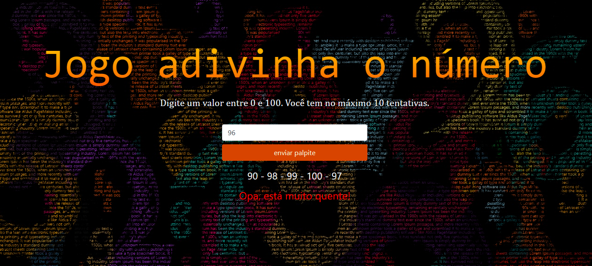

# Jogo Adivinha
Um jogo cujo objetivo é adivinhar o número sortido.

<h1 align="center"> Jogo - Adivinha o número </h1>

  

 Projeto desenvolvido com Javascript, CSS3 e HTML5.
 

  <a href="#-sobre-o-projeto">Sobre o projeto</a>&nbsp;&nbsp;&nbsp;|&nbsp;&nbsp;&nbsp; 
  <a href="#-layouts">Layouts</a>&nbsp;&nbsp;&nbsp;|&nbsp;&nbsp;&nbsp;
  <a href="#-requisitos-e-recomendações">Requisitos e recomendações</a>&nbsp;&nbsp;&nbsp;&nbsp;&nbsp;&nbsp;

</img>

# 💻 Sobre o projeto 

Jogo criado com objetivo de aplicar alguns conhecimentos em javascript, CSS3 e HTML5 adquiridos no curso "Desenvolvimento Web Completo" da Udemy. O sistema consiste em um jogo simples de advinhação que pode ser acessado diretamente no navegador pelo link que está em "requisitos e recomendações" deste README.

  

# 📸 Layouts 

<h3 align="center">Tela pricipal do jogo</h3>

</img>

  

# 📝 Requisitos e recomendações

RECOMENDAÇÕES:
Para acessá-lo, clique aqui: <a href="https://yvesls.github.io/Jogo-Adivinha/index">Jogo - Adivinha o número</a>

  

# ✒️ Autor

Yves Lima Silva

<a href="https://www.linkedin.com/in/yves-lima-b63b2515b/"> Linkedin </a>

